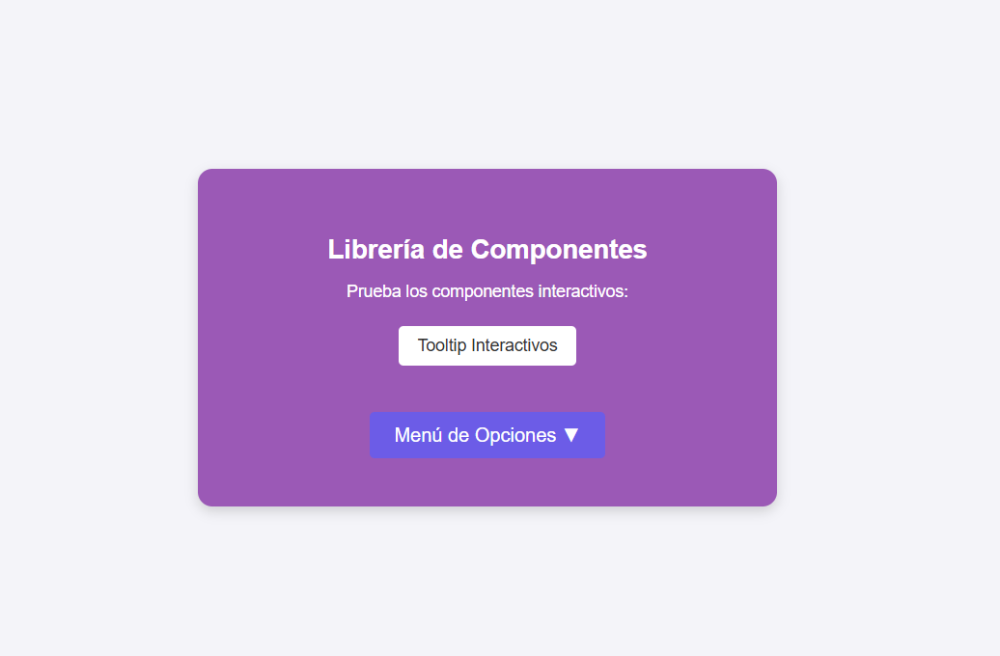
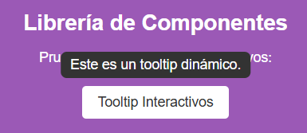
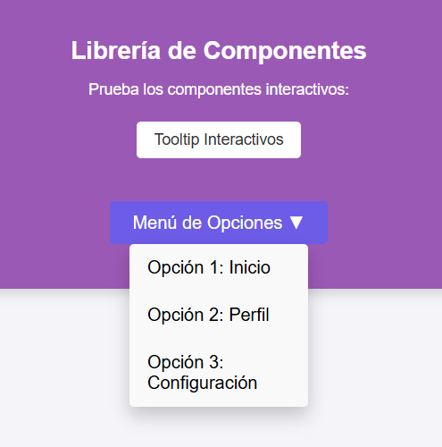

# Librería Visual Reutilizable: Componente.js

## Portada

> **Autora:** Xana Amalinalli Pérez Jiménez  
> **Institución:** Instituto Tecnológico de Oaxaca 
* **Nombre de la librería:** Componente.js
* **Componentes incluidos:** Un tooltip dinámico (`crearTooltip`) y un menú desplegable interactivo (`crearDropdown`).
* **Problema que resuelve:** Permite agregar elementos interactivos y de ayuda visual en cualquier página web mediante código modular y reutilizable, evitando la necesidad de reescribir la estructura o depender de librerías externas pesadas.

## Instalación
Para incluir y utilizar estos componentes en tu proyecto web, debes enlazar la hoja de estilos en la etiqueta `<head>` y el archivo de JavaScript antes de cerrar la etiqueta `<body>` de la siguiente manera:

<!DOCTYPE html>
<html lang="es">
<head>
  <meta charset="UTF-8">
  <title>Mi Proyecto</title>
  <link rel="stylesheet" href="css/componente.css">
</head>
<body>
  
</body>
</html>

## Uso con Ejemplos de Código Embebido
A continuación se muestra el código real y formateado para inicializar y utilizar los componentes de manera dinámica:

1. Ejemplo de uso del Tooltip
Para implementar el componente tooltip, primero agregamos el elemento en el código HTML:
<button id="miBoton">Tooltip Interactivo</button>

Y después inicializamos el componente mediante JavaScript pasando el selector y el texto correspondiente:
crearTooltip("#miBoton", "Este es un texto de ayuda dinámico.");

2. Ejemplo de uso del Menú Desplegable
Para implementar el menú desplegable, declaramos un contenedor vacío en el HTML:

Y a continuación lo activamos en JavaScript pasando el selector, el título del botón y las opciones deseadas:
crearDropdown("#miMenuDropdown", "Menú de Opciones ▼", [
  { texto: "Opción 1: Inicio", enlace: "#" },
  { texto: "Opción 2: Perfil", enlace: "#" },
  { texto: "Opción 3: Configuración", enlace: "#" }
]);

## Capturas de Pantalla
* Vista general de la interfaz:
  

* Componente Tooltip en funcionamiento:
  

* Menú Desplegable en funcionamiento:
  
